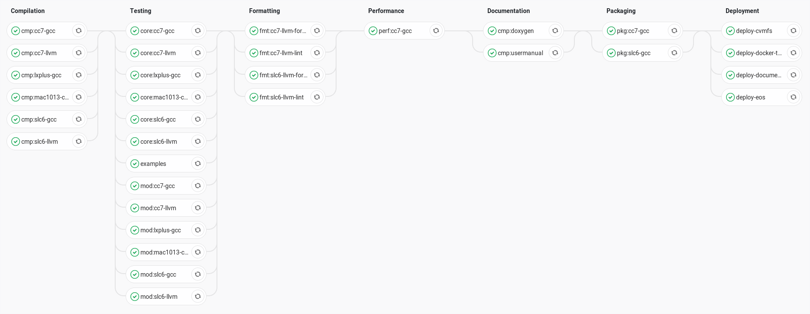

Quality and compatibility of the Allpix Squared framework is ensured by an elaborate continuous integration (CI) which builds
and tests the software on all supported platforms. The Allpix Squared CI uses the GitLab Continuous Integration features and
consists of seven distinct stages as depicted in the figure below. It is configured via the `.gitlab-ci.yml` file in the
repository's root directory, while additional setup scripts for the GitLab Ci Runner machines and the Docker instances can be
found in the `.gitlab/ci` directory.

\
*Typical Allpix Squared continuous integration pipeline with 34 jobs distributed over seven distinct stages. In this example,
all jobs passed.*

The **compilation** stage builds the framework from the source on different platforms. Currently, builds are performed on
CentOS 7, CentOS 8, and macOS. On Linux type platforms, the framework is compiled with recent versions of GCC and Clang, while
the latest AppleClang is used on macOS. The build is always performed with the default compiler flags enabled for the
project:
```
-pedantic -Wall -Wextra -Wcast-align -Wcast-qual -Wconversion
-Wuseless-cast -Wctor-dtor-privacy -Wzero-as-null-pointer-constant
-Wdisabled-optimization -Wformat=2 -Winit-self -Wlogical-op
-Wmissing-declarations -Wmissing-include-dirs -Wnoexcept
-Wold-style-cast -Woverloaded-virtual -Wredundant-decls
-Wsign-conversion -Wsign-promo -Wstrict-null-sentinel
-Wstrict-overflow=5 -Wswitch-default -Wundef -Werror -Wshadow
-Wformat-security -Wdeprecated -fdiagnostics-color=auto
-Wheader-hygiene
```

The **testing** stage executes the framework system and unit tests described in the next chapter. Different jobs are used to
run different test types. This allows to optimize the CI setup depending on the demands of the test to be executed. All tests
are expected to pass, and no code that fails to satisfy all tests will be merged into the repository.

The **formatting** stage ensures proper formatting of the source code using the `clang-format` and following the coding
conventions defined in the `.clang-format` file in the repository. In addition, the `clang-tidy` tool is used for "linting"
of the source code. This means, the source code undergoes a static code analysis in order to identify possible sources of
bugs by flagging suspicious and non-portable constructs used. Tests are marked as failed if either of the CMake targets
`make check-format` or `make check-lint` fail. No code that fails to satisfy the coding conventions and formatting tests will
be merged into the repository. Furthermore, also basic sanity checks are carried out on the CMake build framework code using
`cmake-lint`.

The **performance** stage runs a longer simulation with several thousand events and measures the execution time. This
facilitates monitoring of the simulation performance, a failing job would indicate a degradation in speed. These CI jobs run
on dedicated machines with only one concurrent job. Performance tests are separated into their own CI stage because their
execution is time consuming and they should only be started once proper formatting of the new code is established.

The **documentation** stage prepares this user manual as well as the Doxygen source code documentation for publication. This
also allows to identify e.g. failing compilation of the LaTeX document.

The **packaging** stage wraps the compiled binaries up into distributable tarballs for several platforms. This includes
adding all libraries and executables to the tarball as well as preparing the `setup.sh` script to prepare run-time
dependencies using the information provided to the build system. This procedure is described in more detail in
[Section 10.2](./02_packaging.md).

Finally, the **deployment** stage is only executed for new tags in the repository. Whenever a tag is pushed, this stages
receives the build artifacts of previous stages and publishes them to the Allpix Squared project website through the EOS file
\[[@eos]\]. More detailed information on deployments is provided in [Section 10.4](./04_deployment.md).


[@eos]: http://stacks.iop.org/1742-6596/331/i=5/a=052015
