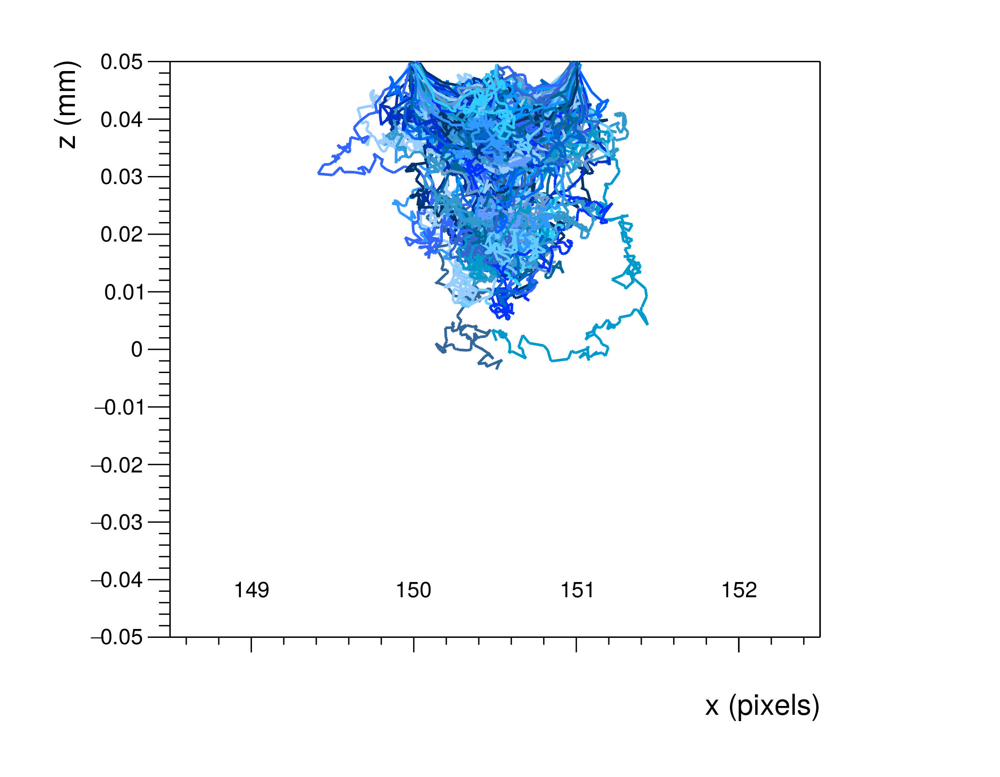

#### How can I produce nicely looking drift-diffusion line graphs?

The GenericPropagation module offers the possibility to produce line graphs depicting the path each of the charge carrier
groups have taken during the simulation. This is a very useful way to visualize the drift and diffusion along field lines.

An optional parameter allows to reduce the lines drawn to those charge carrier groups which have reached the sensor surface
to provide some insight into where from the collected charge carriers originate and how they reached the implants. One graph
is written per event simulated, usually this option should thus only be used when simulating one or a few events but not
during a production run.

In order to produce a precise enough line graph, the integration time steps have to be chosen carefully - usually finer than
necessary for the actual simulation. Below is a set of settings used to simulate the drift and diffusion in a high
resistivity CMOS silicon sensor. Settings of the module irrelevant for the line graph production have been omitted.

```ini
[GenericPropagation]
charge_per_step = 5
timestep_min = 1ps
timestep_max = 5ps
timestep_start = 1ps
spatial_precision = 0.1nm

output_linegraphs = true
output_plots_step = 100ps
output_plots_align_pixels = true
output_plots_use_pixel_units = true

# Optional to only draw charge carrier groups which reached the implant side:
# output_plots_lines_at_implants = true
```

With these settings, a graph of similar precision to the one presented in the figure below can be produced. The required time
stepping size and number of output plot steps varies greatly with the sensor and its applied electric field. The number of
charge carriers per group can be used to vary the density of lines drawn. Larger groups result in fewer lines.

\
*Drift and diffusion visualization of charge carrier groups being transported through a high-resistivity CMOS silicon sensor.
The plot shows the situation after an integration time of 20 nanoseconds, only charge carrier groups which reached the
implant side of the sensor are drawn.*
